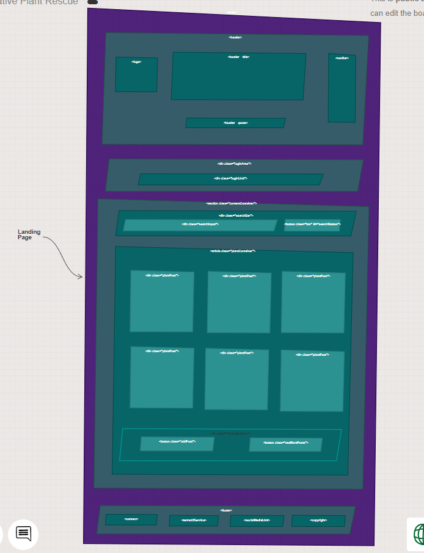

# Native Plant Rescue
This application is designed for gardeners to exchange native plants. A user can create a post for any plants they want to give away and others can come pick them up. A user however cannot post a plant that is not native to the Nashville Area.

## Motivation
Native plants are incredibly important to our ecosystem and are being driven out by invasive, non-native plant species. I want to promote the conservation of native plants through this application. I also want access to native plants to be available to all at no cost. These are the two biggest motivating factors for me: equal access and sustainability. 
<br></br>


## Wireframe



## ERD


## Dependency Chart


## Tech Stack
*Built with*
 - [Plant.Id](https://plant.id/) API - [GitHub](https://github.com/Plant-id/Plant-id-API)
 - React
 - JavaScript
 - HTML
 - CSS

## Features
- The user can upload a photo and identify their plant.
- If the plant is not a native to Nashville, Tennessee, it cannot be posted.
- The user can create a post with an address for the plant to be picked up.
- The user can edit and delete their posts.
- The user can search other posts and claim plants that they have picked up.
- The user can view their own posts.

## Installation
```
git clone git@github.com:kylieanyce/native-plant-rescue.git
cd api
json-server -w database.json -p 8088
..
npm install
npm start
```


## How To Use
This application uses a json-server data store that only contains a few Nashville native plants. To find a match, either upload a photo that has one of the scientific names already listed under TnNatives in the json data store, or add a scientific name to the data store that matches the photo being uploaded. 

An external API key to use the Plant.id API is also needed. Request an API key [here](https://web.plant.id/plant-identification-api/).

Once the user navigates to the page, register with name an email. Then the user can search or browse the **Available Plants** library. Photos of plants can be clicked and the user will see details of each plant. They can click the *'Yes'* button if they have already picked up the plant. This takes the plant out of the **Available Plants** library. If they are the creator of the post, they will see an *'edit'* and *'delete'* button so they can make edits or delete their post. The user can also navigate to the **My Posts** page and see only their posts.

When the user wants to create a post, they can click on the *'Create A Post'* affordance in the navigation bar. This takes them to the **Verify Your Plant Is Native** form where they can then upload the image. If it is a native Nashville plant, they can click the *'This is my plant!'* affordance and will be taken to the **Create Post** form. Here, they can enter an address and optional pick up details, then post their plant. 

## Credits
- The [Plant.Id](https://plant.id/) API was a wonderful resource for this project and the folks there have been incredibly kind and generous as I have been working on it. This API has impressive features, and was slightly challenging and fun to learn!
- The Native Plant Rescue Squad non-profit located in Knoxville, TN was a big inspiration for this project. I loved their idea of saving native plants and was inspired to do similar work but with a slightly different approach.
- Nashville Software School and my Cohort-46 colleagues. THANK YOU!
